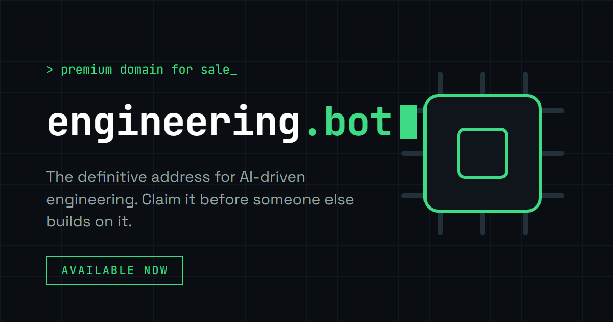

# engineering.bot

**Premium exact-match `.bot` domain lander** — claim / inquire flow for [engineering.bot](https://engineering.bot).



## What it is

- High-signal domain-for-sale / partnership lander  
- Sections: why it fits, integration story, market proof, claim form  
- Cloudflare Pages Functions for form submit (`functions/api/submit.ts`)  

## Stack

| Layer | Tech |
|-------|------|
| Frontend | React, TypeScript, Vite, Tailwind / shadcn-style UI |
| API | Cloudflare Pages Functions |
| Hosting | Cloudflare Pages (`wrangler.toml`) |

## Quick start

```bash
npm install
npm run dev
npm run build
```

## Repo layout

- `src/components/landing/` — Hero, WhyFit, Integration, MarketProof, Claim, Footer  
- `public/og.png` — social preview  
- `functions/` — edge form handler  

## License

All rights reserved. Domain for sale / claim.
